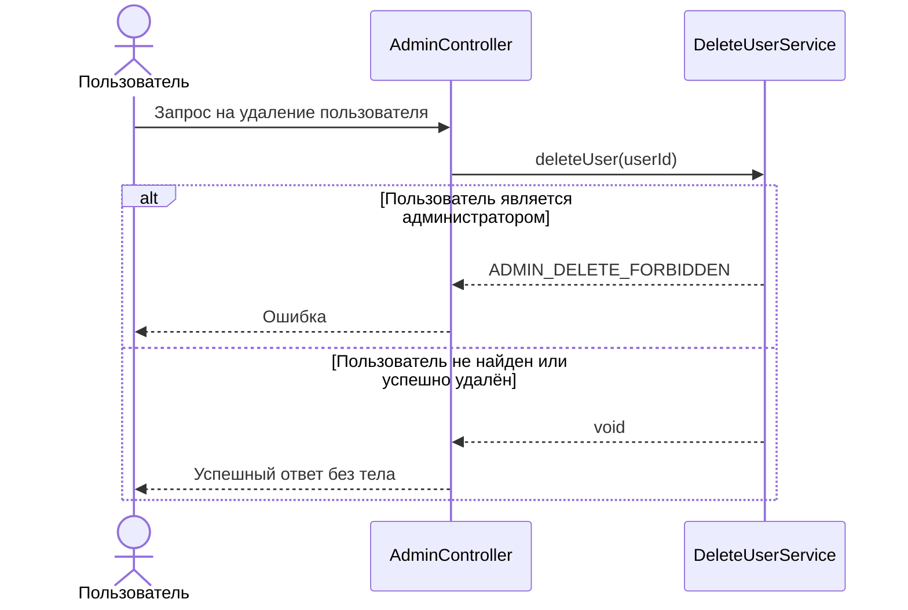

# 🌐 Удаление пользователя

> Эндпоинт удаляет пользователя по идентификатору. Если пользователь не найден, операция считается успешно выполненной. 
> Если пользователь является администратором, удаление запрещается

## ⚙️ Основные характеристики

- ### 🔗 Endpoint
  | Характеристика       | Значение                 |
  |----------------------|--------------------------|
  | URL                  | `/admin/users/{user_id}` |
  | Метод                | `DELETE`                 |
  | Код успешного ответа | `204`                    |

- ### 📥 Параметры эндпоинта
  | Параметр  | Тип      | Обязательное | Описание                              |
  |-----------|----------|-------------:|---------------------------------------|
  | `user_id` | `number` |            ✅ | Идентификатор удаляемого пользователя |

---

## 🔁 Sequence диаграмма



---

## 🧠 Алгоритм

1. Получаем `user_id` из path-параметра
2. Ищем роль пользователя по переданному идентификатору
   ```sql
   select role
   from users
   where id = :user_id
   ```
3. Если пользователь не найден, операция завершается успешно без удаления записей
4. Если пользователь найден и его роль `ADMIN`, возвращаем ошибку `ADMIN_DELETE_FORBIDDEN`
5. Если пользователь найден и не является администратором, удаляем пользователя
   ```sql
   delete from users
   where id = :user_id
   ```
6. Связанные OTP-коды пользователя удаляются каскадно на уровне внешнего ключа
7. После успешного выполнения возвращается ответ без тела
