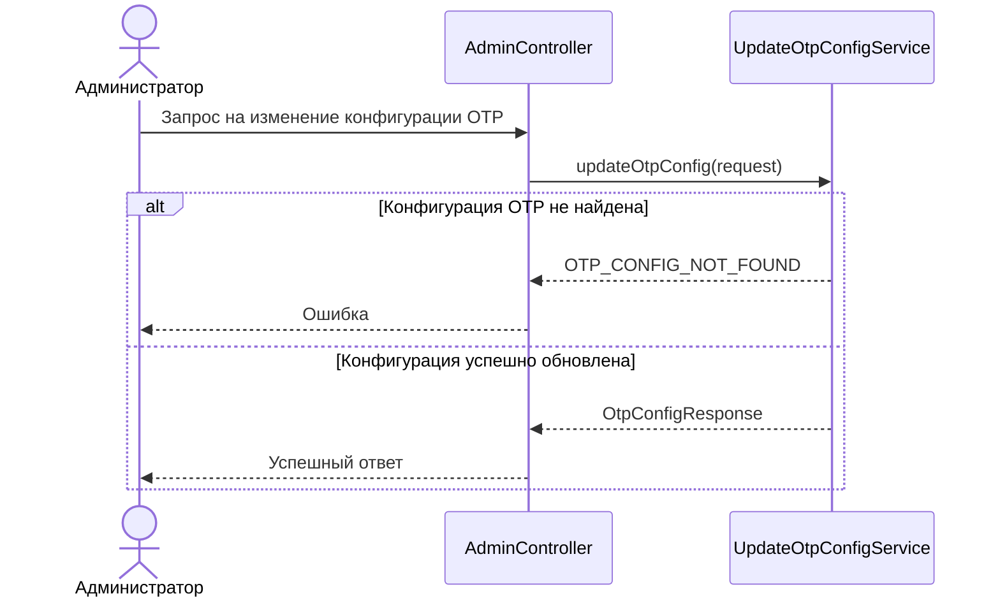

# 🌐 Изменение конфигурации OTP-кодов

> Эндпоинт обновляет текущую конфигурацию OTP-кодов: длину генерируемого кода и время его жизни

## ⚙️ Основные характеристики

- ### 🔗 Endpoint
  | Характеристика       | Значение            |
  |----------------------|---------------------|
  | URL                  | `/admin/otp-config` |
  | Метод                | `PATCH`             |
  | Код успешного ответа | `200`               |

- ### 📥 Запрос
  | Поле JSON     | Тип      | Обязательное | Описание                         | Валидация                         |
  |---------------|----------|-------------:|----------------------------------|-----------------------------------|
  | `code_length` | `number` |            ✅ | Количество символов в OTP-коде   | Значение от `4` до `10`           |
  | `ttl_seconds` | `number` |            ✅ | Время жизни OTP-кода в секундах  | Значение должно быть больше `0`   |

- ### 📤 Успешный ответ
  | Поле JSON     | Тип      | Обязательное | Описание                         |
  |---------------|----------|-------------:|----------------------------------|
  | `code_length` | `number` |            ✅ | Количество символов в OTP-коде   |
  | `ttl_seconds` | `number` |            ✅ | Время жизни OTP-кода в секундах  |

---

## 🔁 Sequence диаграмма



---

## 🧠 Алгоритм

1. Получаем `code_length` и `ttl_seconds` из запроса
2. Обновляем единственную запись конфигурации OTP-кодов
   ```sql
   update otp_config
   set code_length = :code_length,
       ttl_seconds = :ttl_seconds,
       updated_at = now()
   where id = 1
   returning id,
       code_length,
       ttl_seconds,
       updated_at
   ```
3. Если запись конфигурации не найдена, возвращаем ошибку `OTP_CONFIG_NOT_FOUND`
4. Если запись успешно обновлена, возвращаем актуальные значения `code_length` и `ttl_seconds`
