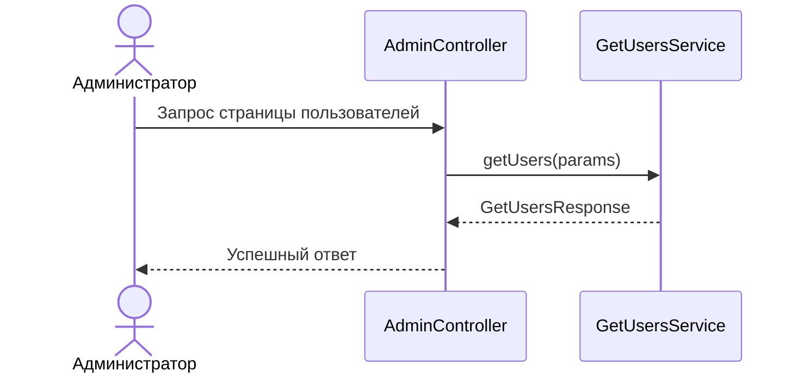

# 🌐 Получение пользователей

> Эндпоинт возвращает страницу пользователей без администраторов. Для ограничения размера ответа используется пагинация

## ⚙️ Основные характеристики

- ### 🔗 Endpoint
  | Характеристика       | Значение       |
  |----------------------|----------------|
  | URL                  | `/admin/users` |
  | Метод                | `GET`          |
  | Код успешного ответа | `200`          |

- ### 📥 Параметры эндпоинта
  | Параметр | Тип      | Обязательное | Описание        | Валидация                                        |
  |----------|----------|-------------:|-----------------|--------------------------------------------------|
  | `page`   | `number` |            ❌ | Номер страницы  | Значение не может быть меньше `0`                |
  | `size`   | `number` |            ❌ | Размер страницы | Значение не может быть меньше `0` и больше `100` |

- ### 📤 Успешный ответ
  | Поле JSON        | Тип      | Обязательное | Описание                                 |
  |------------------|----------|-------------:|------------------------------------------|
  | `users`          | `array`  |            ✅ | Список пользователей на текущей странице |
  | `page`           | `number` |            ✅ | Номер текущей страницы                   |
  | `size`           | `number` |            ✅ | Размер текущей страницы                  |
  | `total_elements` | `number` |            ✅ | Общее количество пользователей           |
  | `total_pages`    | `number` |            ✅ | Общее количество страниц                 |

  Поля элемента массива `users`:

  | Поле JSON | Тип      | Обязательное | Описание                              |
  |-----------|----------|-------------:|---------------------------------------|
  | `id`      | `number` |            ✅ | Уникальный идентификатор пользователя |
  | `login`   | `string` |            ✅ | Логин пользователя                    |
  | `role`    | `string` |            ✅ | Роль пользователя                     |

---

## 🔁 Sequence диаграмма



---

## 🧠 Алгоритм

1. Получаем параметры `page` и `size` из query-параметров эндпоинта
2. Если `size` равен `0`, используется размер страницы по умолчанию
3. Рассчитываем `offset` по номеру и размеру страницы
4. Получаем страницу пользователей без администраторов
   ```sql
   select id,
       login,
       role
   from users
   where role <> 'ADMIN'
   order by id
   limit :limit
   offset :offset
   ```
5. Получаем общее количество пользователей без администраторов
   ```sql
   select count(*)
   from users
   where role <> 'ADMIN'
   ```
6. Рассчитываем общее количество страниц
7. Возвращаем страницу пользователей и метаданные пагинации
