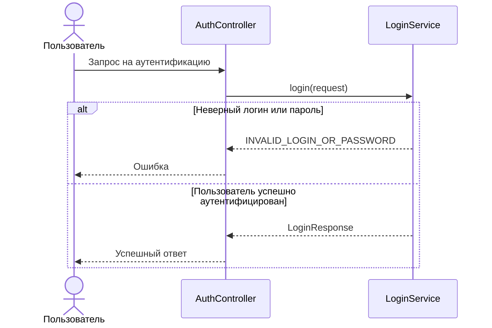

# 🌐 Аутентификация пользователя

> Эндпоинт проверяет логин и пароль пользователя. Если данные корректны, возвращается JWT-токен для дальнейшей 
> авторизации

## ⚙️ Основные характеристики

- ### 🔗 Endpoint
  | Характеристика       | Значение      |
  |----------------------|---------------|
  | URL                  | `/auth/login` |
  | Метод                | `POST`        |
  | Код успешного ответа | `200`         |

- ### 📥 Запрос
  | Поле JSON  | Тип      | Обязательное | Описание             | Валидация                                          |
  |------------|----------|-------------:|----------------------|----------------------------------------------------|
  | `login`    | `string` |            ✅ | Логин пользователя   | Не пустое значение, длина от `3` до `100` символов |
  | `password` | `string` |            ✅ | Пароль пользователя  | Не пустое значение, длина от `6` до `100` символов |

- ### 📤 Успешный ответ
  | Поле JSON | Тип      | Обязательное | Описание                           |
  |-----------|----------|-------------:|------------------------------------|
  | `token`   | `string` |            ✅ | JWT-токен для авторизации запросов |

---

## 🔁 Sequence диаграмма



---

## 🧠 Алгоритм

1. Получаем `login` и `password` из запроса
2. Ищем пользователя по логину
   ```sql
   select id,
       login,
       password_hash,
       role
   from users
   where login = :login
   ```
3. Если пользователь не найден, возвращаем ошибку `INVALID_LOGIN_OR_PASSWORD`
4. Если пользователь найден, сравниваем переданный пароль с сохранённым хэшем
5. Если пароль не совпадает с хэшем, возвращаем ошибку `INVALID_LOGIN_OR_PASSWORD`
6. Если пароль корректный, генерируем JWT-токен с идентификатором, логином и ролью пользователя
7. Возвращаем успешный ответ с JWT-токеном
