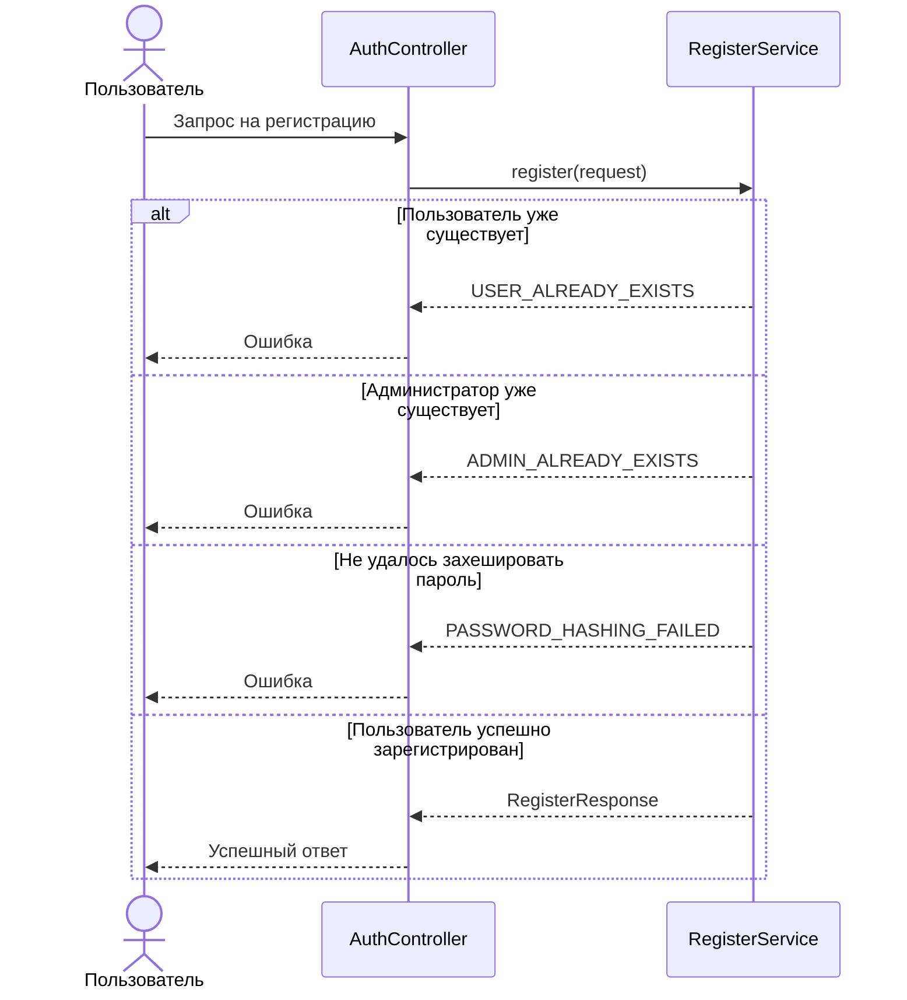

# 🌐 Регистрация пользователя

> Эндпоинт регистрирует нового пользователя с указанной ролью. Если пользователь с таким логином уже существует или 
> администратор уже зарегистрирован, возвращается ошибка

## ⚙️ Основные характеристики

- ### 🔗 Endpoint
  | Характеристика       | Значение         |
  |----------------------|------------------|
  | URL                  | `/auth/register` |
  | Метод                | `POST`           |
  | Код успешного ответа | `200`            |

- ### 📥 Запрос
  | Поле JSON  | Тип      | Обязательное | Описание             | Валидация                                           |
  |------------|----------|-------------:|----------------------|-----------------------------------------------------|
  | `login`    | `string` |            ✅ | Логин пользователя   | Не пустое значение, длина от `3` до `100` символов  |
  | `password` | `string` |            ✅ | Пароль пользователя  | Не пустое значение, длина от `6` до `100` символов  |
  | `role`     | `string` |            ✅ | Роль пользователя    | Значение должно соответствовать поддерживаемой роли |

- ### 📤 Успешный ответ
  | Поле JSON | Тип      | Обязательное | Описание                              |
  |-----------|----------|-------------:|---------------------------------------|
  | `id`      | `number` |            ✅ | Уникальный идентификатор пользователя |
  | `login`   | `string` |            ✅ | Логин пользователя                    |
  | `role`    | `string` |            ✅ | Роль пользователя                     |

---

## 🔁 Sequence диаграмма



---

## 🧠 Алгоритм

1. Получаем `login`, `password` и `role` из запроса
2. Проверяем, существует ли пользователь с указанным логином
   ```sql
   select exists(
       select 1
       from users
       where login = :login
   )
   ```
3. Если пользователь уже существует, возвращаем ошибку `USER_ALREADY_EXISTS`
4. Если регистрируется администратор, проверяем наличие существующего администратора
   ```sql
   select exists(
       select 1
       from users
       where role = 'ADMIN'
   )
   ```
5. Если администратор уже существует, возвращаем ошибку `ADMIN_ALREADY_EXISTS`
6. Хэшируем пароль пользователя
7. Если хэширование завершилось ошибкой, возвращаем ошибку `PASSWORD_HASHING_FAILED`
8. Создаём пользователя в БД
   ```sql
   insert into users (
       login,
       password_hash,
       role
   )
   values (
       :login,
       :password_hash,
       :role
   )
   returning id,
       login,
       role
   ```
9. Возвращаем успешный ответ с данными созданного пользователя
