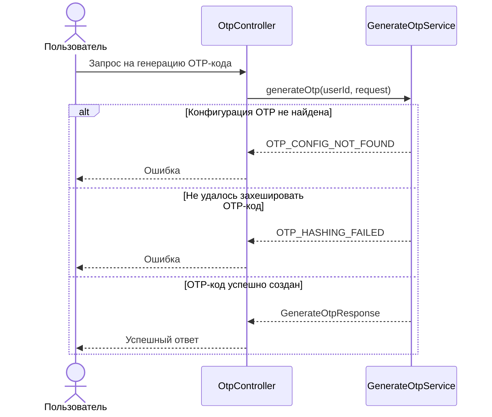

# 🌐 Генерация OTP-кода

> Эндпоинт генерирует OTP-код для указанной операции, сохраняет его хэш в БД и создаёт запись outbox для последующей 
> отправки кода выбранным каналом

## ⚙️ Основные характеристики

- ### 🔗 Endpoint
  | Характеристика       | Значение        |
  |----------------------|-----------------|
  | URL                  | `/otp/generate` |
  | Метод                | `POST`          |
  | Код успешного ответа | `200`           |

- ### 📥 Запрос
  | Поле JSON              | Тип      | Обязательное | Описание                                              | Валидация                                              |
  |------------------------|----------|-------------:|-------------------------------------------------------|--------------------------------------------------------|
  | `operation_id`         | `string` |            ✅ | Идентификатор операции, для которой создаётся OTP-код | Не пустое значение, длина от `1` до `255` символов     |
  | `notification_channel` | `string` |            ✅ | Канал отправки OTP-кода                               | Значение должно соответствовать поддерживаемому каналу |
  | `destination`          | `string` |            ✅ | Получатель OTP-кода                                   | Не пустое значение, длина от `1` до `255` символов     |

- ### 📤 Успешный ответ
  | Поле JSON      | Тип      | Обязательное | Описание                                                |
  |----------------|----------|-------------:|---------------------------------------------------------|
  | `operation_id` | `string` |            ✅ | Идентификатор операции, для которой был создан OTP-код  |

---

## 🔁 Sequence диаграмма



---

## 🧠 Алгоритм

1. Получаем `operation_id`, `notification_channel` и `destination` из запроса, и `user_id` из JWT-токена
2. Получаем текущую конфигурацию OTP-кодов
   ```sql
   select code_length,
       ttl_seconds
   from otp_config
   where id = 1
   ```
3. Если конфигурация не найдена, возвращаем ошибку `OTP_CONFIG_NOT_FOUND`
4. Генерируем OTP-код с длиной из конфигурации
5. Хэшируем OTP-код
6. Если хэширование завершилось ошибкой, возвращаем ошибку `OTP_HASHING_FAILED`
7. Сохраняем хэш OTP-кода в таблицу `otp_codes`
   ```sql
   insert into otp_codes (
       user_id,
       operation_id,
       code_hash,
       status,
       expires_at
   )
   values (
       :user_id,
       :operation_id,
       :code_hash,
       'ACTIVE',
       :expires_at
   )
   ```
8. Шифруем исходный OTP-код для сохранения в outbox
9. Создаём запись в `notification_outbox` для последующей отправки OTP-кода
   ```sql
   insert into notification_outbox (
       notification_channel,
       destination,
       encrypted_code
   )
   values (
       :notification_channel,
       :destination,
       :encrypted_code
   )
   ```
10. Если обе записи успешно сохранены, возвращаем успешный ответ с `operation_id`
