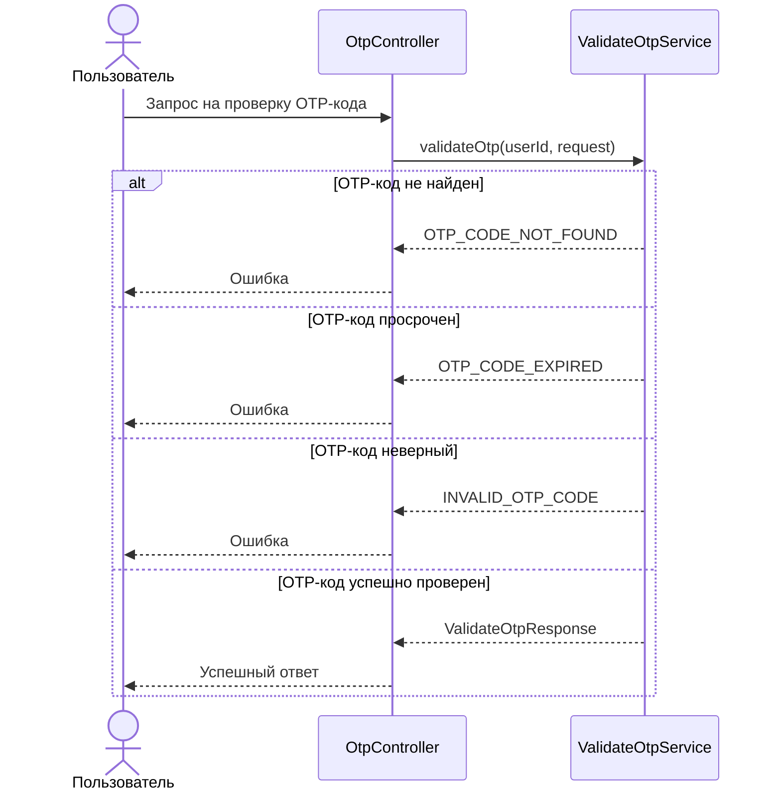

# 🌐 Валидация OTP-кода

> Эндпоинт проверяет переданный OTP-код для указанной операции: если код активен, не просрочен и совпадает с 
> сохранённым хэшем, он помечается как использованный

## ⚙️ Основные характеристики

- ### 🔗 Endpoint
  | Характеристика       | Значение        |
  |----------------------|-----------------|
  | URL                  | `/otp/validate` |
  | Метод                | `POST`          |
  | Код успешного ответа | `200`           |

- ### 📥 Запрос
  | Поле JSON      | Тип      | Обязательное | Описание                                                | Валидация                                          |
  |----------------|----------|-------------:|---------------------------------------------------------|----------------------------------------------------|
  | `operation_id` | `string` |            ✅ | Идентификатор операции, для которой проверяется OTP-код | Не пустое значение, длина от `1` до `255` символов |
  | `code`         | `string` |            ✅ | OTP-код, введённый пользователем                        | Не пустое значение, длина от `4` до `10` символов  |

- ### 📤 Успешный ответ
  | Поле JSON      | Тип       | Обязательное | Описание                                                 |
  |----------------|-----------|-------------:|----------------------------------------------------------|
  | `operation_id` | `string`  |            ✅ | Идентификатор операции, для которой был проверен OTP-код |
  | `valid`        | `boolean` |            ✅ | Признак успешной проверки OTP-кода                       |

---

## 🔁 Sequence диаграмма



---

## 🧠 Алгоритм

1. Получаем `operation_id` и `code` из запроса, и `user_id` из JWT-токена
2. Ищем активный OTP-код пользователя для указанной операции
   ```sql
   select id,
       code_hash,
       expires_at
   from otp_codes
   where user_id = :user_id
       and operation_id = :operation_id
       and status = 'ACTIVE'
   order by created_at desc
   limit 1
   ```
3. Если активный OTP-код не найден, то возвращаем ошибку `OTP_CODE_NOT_FOUND`
4. Если OTP-код найден, то проверяем срок его действия
5. Если срок действия истёк, код переводится в статус `EXPIRED`
   ```sql
   update otp_codes
   set status = 'EXPIRED'
   where id = :id
       and status = 'ACTIVE'
   ```
6. После этого сервис возвращает ошибку `OTP_CODE_EXPIRED`
7. Если код не просрочен, сервис сравнивает переданный OTP-код с сохранённым хэшем
8. Если код не совпадает с хэшем, сервис возвращает ошибку `INVALID_OTP_CODE`
9. Если код корректный, сервис пытается перевести OTP-код в статус `USED`
   ```sql
   update otp_codes
   set status = 'USED',
       used_at = now()
   where id = :id
       and status = 'ACTIVE'
   ```
10. Если запись не была обновлена, сервис возвращает ошибку `INVALID_OTP_CODE`
11. Если запись успешно обновлена, сервис возвращает успешный ответ с `operation_id` и `valid = true`
