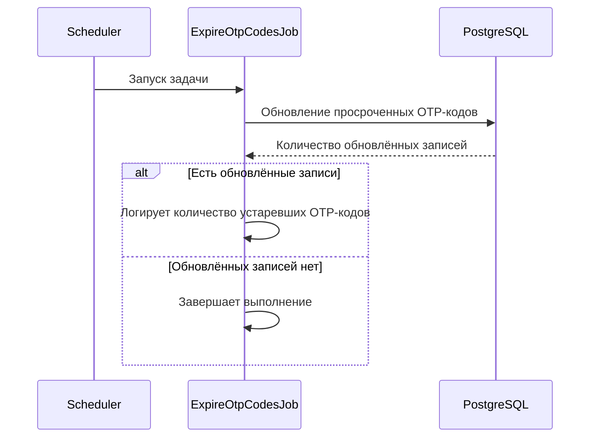

# ⏱️ Устаревание OTP-кодов

> `ExpireOtpCodesJob` — scheduler-задача, которая периодически переводит активные OTP-коды с истёкшим сроком действия в
> статус `EXPIRED`

## ⚙️ Основные характеристики

| Характеристика                 | Значение   |
|--------------------------------|------------|
| Интервал между запусками       | `60000 мс` |
| Задержка перед первым запуском | `10000 мс` |

---

## 🔁 Sequence диаграмма



---

## 🧠 Алгоритм

1. Scheduler запускает задачу через заданный интервал времени
2. Job вызывает репозиторий для обновления просроченных OTP-кодов
3. Репозиторий выполняет запрос в БД
   ```sql
   update otp_codes
   set status = 'EXPIRED'
   where status = 'ACTIVE'
       and expires_at <= now()
   ```
4. БД возвращает количество обновлённых записей
5. Если количество обновлённых записей больше `0`, job логирует количество устаревших OTP-кодов
6. Если просроченных OTP-кодов нет, job завершается без дополнительных действий
