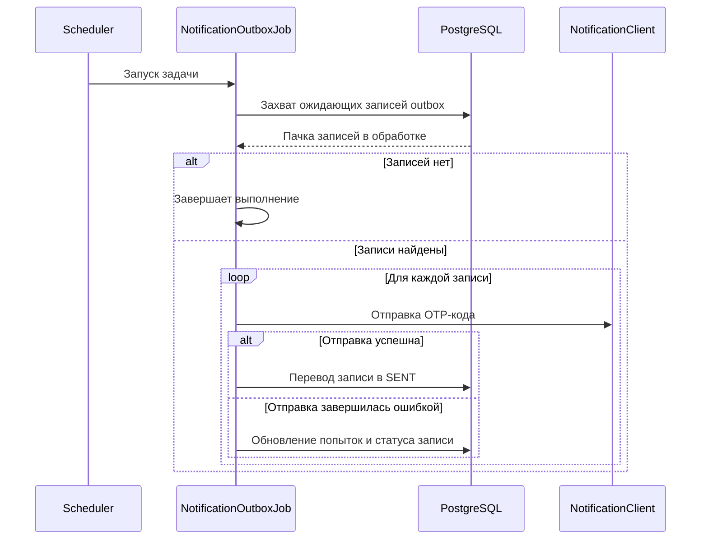

# ⏱️ Отправка уведомлений из outbox

> `NotificationOutboxJob` — scheduler-задача, которая периодически забирает ожидающие записи outbox, расшифровывает OTP-код,
> отправляет его через нужный канал уведомлений и обновляет статус обработки записи

## ⚙️ Основные характеристики

| Характеристика                         | Значение   |
|----------------------------------------|------------|
| Интервал между запусками               | `5000 мс`  |
| Задержка перед первым запуском         | `5000 мс`  |
| Размер пачки                           | `10`       |
| Максимальное количество попыток        | `3`        |
| Максимальная длина сообщения об ошибке | `1000`     |

---

## 🔁 Sequence диаграмма



---

## 🧠 Алгоритм

1. Scheduler запускает задачу через заданный интервал времени
2. Job запрашивает пачку записей outbox, ожидающих отправки
3. Репозиторий атомарно захватывает записи в обработку
   ```sql
   with claimed as (
       select id
       from notification_outbox
       where status = 'PENDING'
       order by created_at
       limit :limit
       for update skip locked
   )
   update notification_outbox
   set status = 'PROCESSING'
   from claimed
   where notification_outbox.id = claimed.id
   returning notification_outbox.id,
       notification_outbox.notification_channel,
       notification_outbox.destination,
       notification_outbox.encrypted_code,
       notification_outbox.attempts
   ```
4. Если записей нет, job завершает выполнение
5. Если записи найдены, job обрабатывает каждую запись отдельно
6. Для каждой записи job расшифровывает OTP-код и отправляет его через нужный канал уведомлений
7. Если отправка прошла успешно, запись переводится в статус `SENT`
   ```sql
   update notification_outbox
   set status = 'SENT',
       processed_at = now(),
       error_message = null
   where id = :id
       and status = 'PROCESSING'
   ```
8. Если отправка завершилась ошибкой, запись обновляется как неуспешная попытка
   ```sql
   update notification_outbox
   set status = case
           when attempts + 1 >= :max_attempts then 'FAILED'
           else 'PENDING'
       end,
       attempts = attempts + 1,
       error_message = :error_message,
       processed_at = case
           when attempts + 1 >= :max_attempts then now()
       end
   where id = :id
       and status = 'PROCESSING'
   ```
9. Если количество попыток меньше максимального, запись возвращается в очередь со статусом `PENDING`
10. Если количество попыток достигло максимального значения, запись переводится в статус `FAILED`
