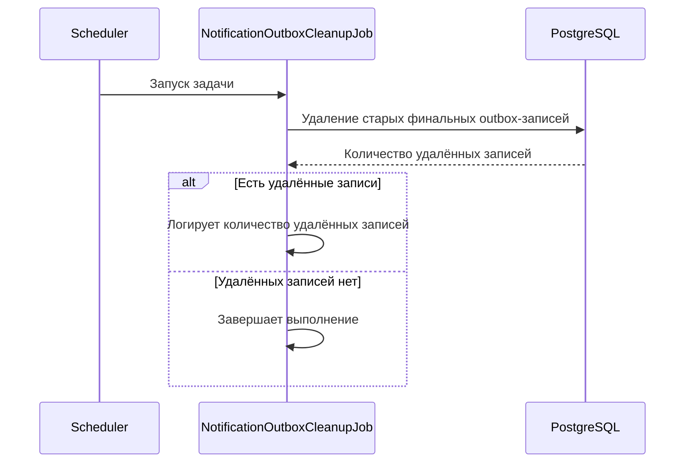

# ⏱️ Очистка outbox-записей

> `NotificationOutboxCleanupJob` — scheduler-задача, которая периодически удаляет старые финальные записи outbox со
> статусами `SENT` и `FAILED`

## ⚙️ Основные характеристики

| Характеристика                 | Значение      |
|--------------------------------|---------------|
| Интервал между запусками       | `86400000 мс` |
| Задержка перед первым запуском | `60000 мс`    |
| Срок хранения `SENT` записей   | `7 дней`      |
| Срок хранения `FAILED` записей | `30 дней`     |

---

## 🔁 Sequence диаграмма



---

## 🧠 Алгоритм

1. Scheduler запускает задачу через заданный интервал времени
2. Job берёт настройки срока хранения для записей со статусами `SENT` и `FAILED`
3. Job вызывает репозиторий для удаления старых финальных outbox-записей
4. Репозиторий выполняет запрос в БД
   ```sql
   delete from notification_outbox
   where (
           status = 'SENT'
           and processed_at <= now() - (:sent_ttl_days * interval '1 day')
       )
      or (
           status = 'FAILED'
           and processed_at <= now() - (:failed_ttl_days * interval '1 day')
       )
   ```
5. БД возвращает количество удалённых записей
6. Если количество удалённых записей больше `0`, job логирует количество очищенных outbox-записей
7. Если старых финальных записей нет, job завершается без дополнительных действий
